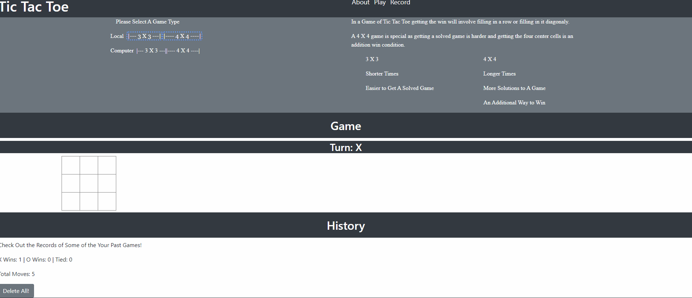

# tictactoe

## Demo

## Future Imporvements
- Adding Keyboard Support
- Imporoving Custom CSS / Fixing Spacing & Formating

## Known Issues
- When playing against a computer, a player is not restricted from making a move. This results in the Computer acting twice for both X and O
- Displaying the winning pattern will not work 4 x 4 boards

## Developed By
- Alexander Berry | Z23442156

## Working Repo
https://github.com/0-Alex-B/tictactoe
